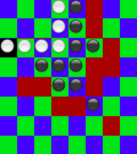

<h1>Reversi</h1>

This is a command-line-based version of the game "Reversi" (also known as Othello) that runs in rails.

Use the colorize gem to provide color in the command-line interface.

To play:

* clone the repo
* run ruby reversi.rb
* use arrow keys to move select your move
 
Note:
* red squares display available moves for the user
* computer player moves automatically after human player moves
* press "q" in the commandline to end the game at any time

